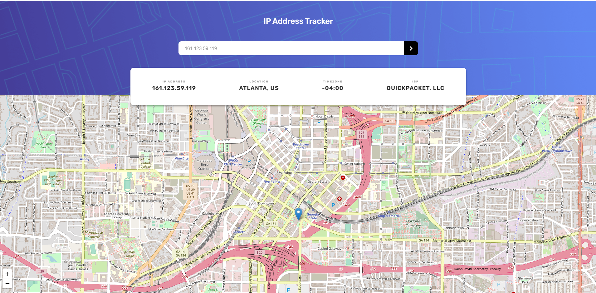
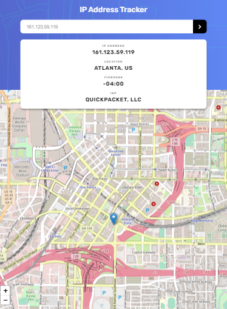

## Overview

React application that plots the location of the IP address on a Leaflet map.

- Live Site URL: [https://sad-torvalds-2091e9.netlify.app/](https://sad-torvalds-2091e9.netlify.app/)

### Screenshot

### Built with

- Semantic HTML5 markup
- CSS custom properties
- Flexbox
- Axios
- Ipify API
- Leaflet API
- CSS Grid
- Mobile-first workflow
- [React](https://reactjs.org/) - JS library

